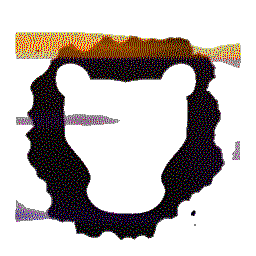

 # Leosac 

* Stable branch: master  
* Development branch: develop   

The documentation for both end user and developpers can be found [here](http://leosac.github.io/leosac-doc/doc_output/develop/).

## What is Leosac?

Leosac is an open source physical access control system software. It is meant to be installed on embedded devices running Linux, to handle the logic processing of an access control. Basically, it opens doors.

A Leosac setup is usually composed of an embedded Linux board running the software, locked in a case, connected to a RFID card reader and to the electric strike of a door.                                                                    

## Features                                                                                                                                                                                                                                    

* Multiple-door/reader support
* Ethernet connectivity
* **Fully** configurable wiring layout
* Portable on virtually every Linux devices on the market
* Open-source

## Getting started  

You can follow the [install guide](https://leosac.github.io/leosac-doc/doc_output/develop/d5/d97/page_guide_rpi_piface_wiegand.html#install_guide)
to have a basic setup ready.

## Issues

Please report issues [here](https://github.com/leosac/leosac/issues).

## License

This project is released under the GNU Affero GPLv3 license.
A copy of the license can be found in the root folder.

